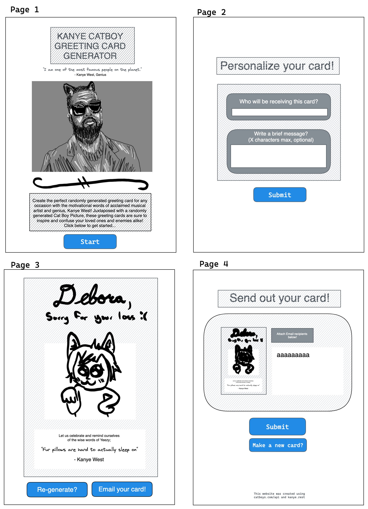

# <center>YE & Catboy anime Card Generator </center>

  
 
 <center>Digital Illustration by C.P.</center>


### *Description*

 Create the perfect randomly generated greeting card for any occasion with the  motivational 
 [words](./assets/YE.png) of aclaimed musical artist and genius, Mr. Kan**YE** West. Juxtaposed with randomly generated CatBoy Anime [image!](./assets/image_7.jpg)


# <center>*Getting Started* </center>



###### <center> wire frame created by Digital Artist C.P.</center>


### *Dependencies*


 - [GitHub](https://github.com/)

 - [Google](https://google.com/)  [/ Fonts](https://fonts.google.com/)


 - [Read the Docs](https://readthedocs.org/)

 - [MkDocs](https://www.mkdocs.org/)

 - [YE Quotes API](https://kanye.rest/)

 - [Catboys API](https://catboys.com/api)

 - [stack overflow](https://stackoverflow.com)

 - [jQuery](https://jQuery.com/)

 - [Excalidraw](https://excalidraw.com/)


 ## *Installing*


[](./assets/greeting%20card%20-%20Google%20Chrome%202022-04-14%2022-48-06.mp4 "Bttns")


## *Excuting Program*

``` html
<div class="picture ">
    <button id="catButtn">Generate a new image</button>
    <button type="submit" id="s4l">Save For Later</button>
    <button type="submit" id="save">SAVE</button>
</div>
```
- **WIP** (work in progress) structure will allow user more versatility.
``` Css

 .card-image-container {
    width: 60%;
    height: 350px;
    background-color: lightblue;
 }
```

- This CSS selector was a key component for page layout due to randomness of imgages sourced from API.


``` javascript
    const kayneBtn = document.getElementById("KayneBtn")
    quoteInput = document.getElementById("quote")

    kayneBtn.addEventListener("click", (event) => {
    event.preventDefault();
    fetch("https://api.kanye.rest")
        .then(response => response.json())
        .then(data => (quoteInput.innerHTML = data.quote));
})
        
```
- This array object was the foundation for this project. In hopes to provide insparation to the user.

  
 
 
 
 [=====================================================================                             ](https://abairdster.github.io/group_project2022/ "click")


## *Work in Progress*

```javascript
1.  const formId = "save-later-form"; 
    const url = location.href; 
    const formIdentifier = `${url} ${formId}`; 
    const saveButton = document.querySelector("#save"); 
    const alertBox = document.querySelector(".alert"); 
    let form = document.querySelector(`#${formId}`); 
    let formElements = form.elements; 
```

```css
2.  .cardView {
    margin: auto;
    width: 70%;
    max-width: 1000px;
    display: flex;
    flex-direction: row;
    border: 20px solid gray;
    font-family: 'Dancing Script', cursive;
    }
    .card-content {
    width: 40%;
    min-width: 40%;
    height: 350px;
    background-color: lightgray;
    }
    .card-image-container {
    width: 60%;
    height: 350px;    // height: auto?
    background-color: lightblue;
    }
    img {
    height: 400px;
    width: 100%;
    margin: 0;
    object-fit: cover;
    }  
    .form-container {
    justify-content: center;
    align-content: center;
    display: flex;
    flex-direction: row;
    padding: 0.8em 0;
    }
 ```
 - contents will leak container with various combinations of lengthy text and larger images

 ## *Authors*


 > ex.  YE TEAM
 > 
 > ex. [@YE_TEAM](https://......)


## *License*

This project is licensed under the [NAME HERE] License - see the LICENSE.md file for details

# *Acknowledgments*


- [slack](https://slack.com/)
- [zoom](https://zoom.us/)
- [VScode](https://code.visualstudio.com/)
